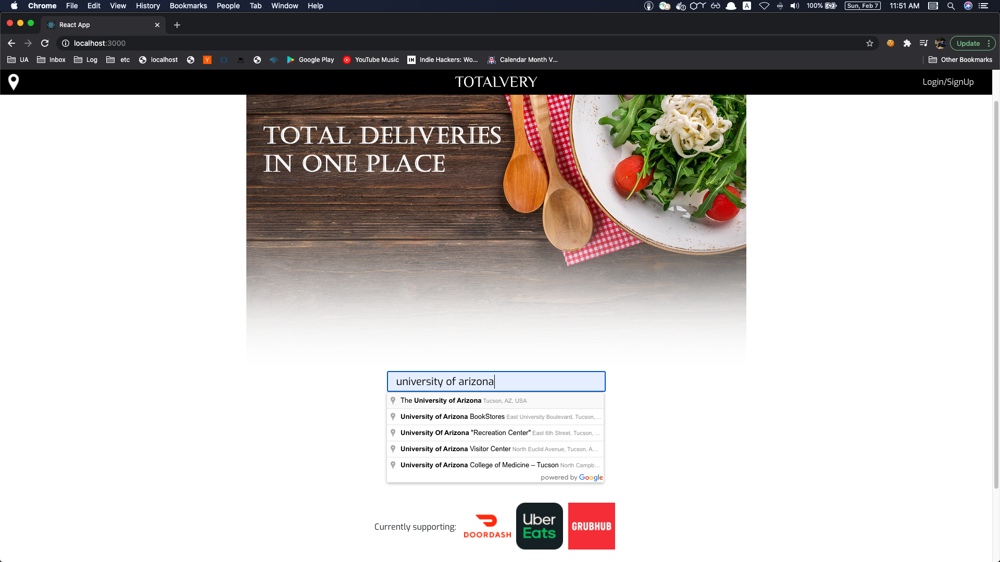
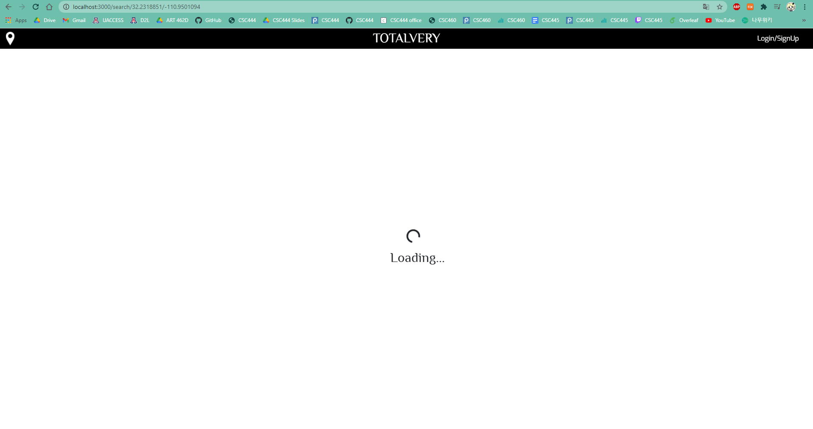
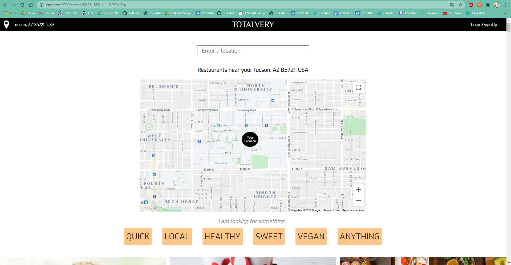
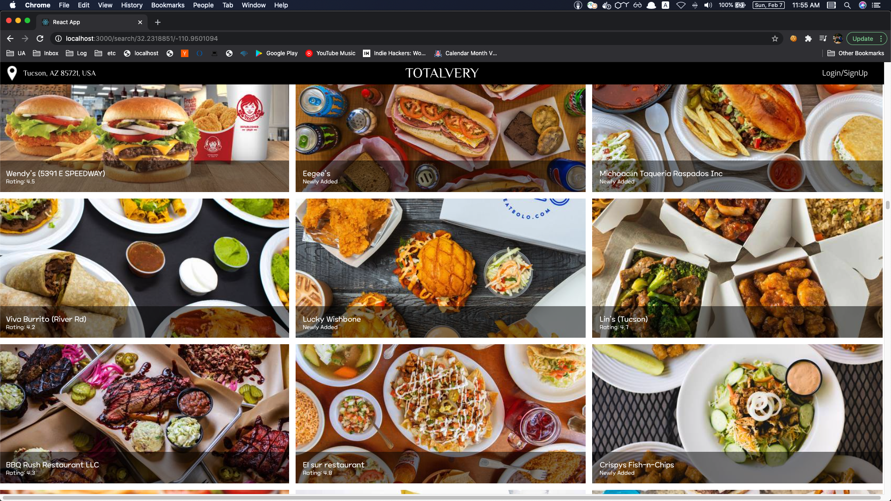
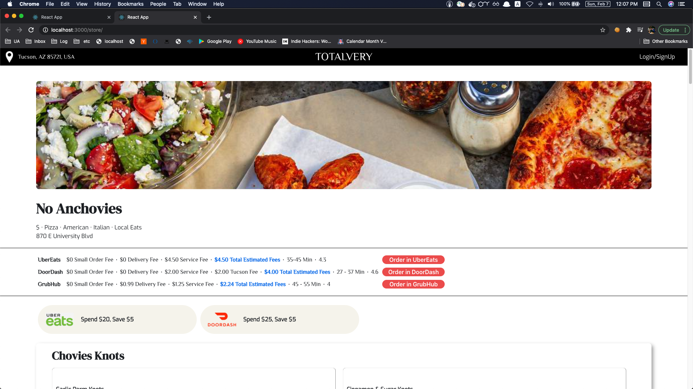
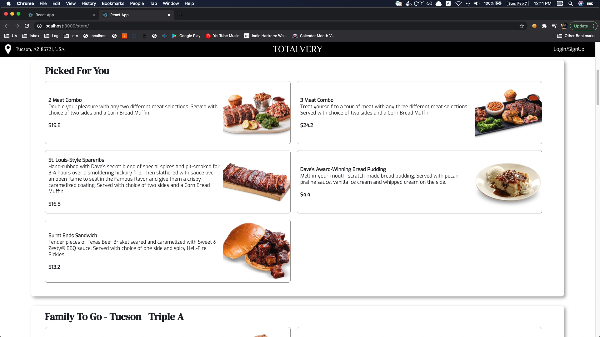
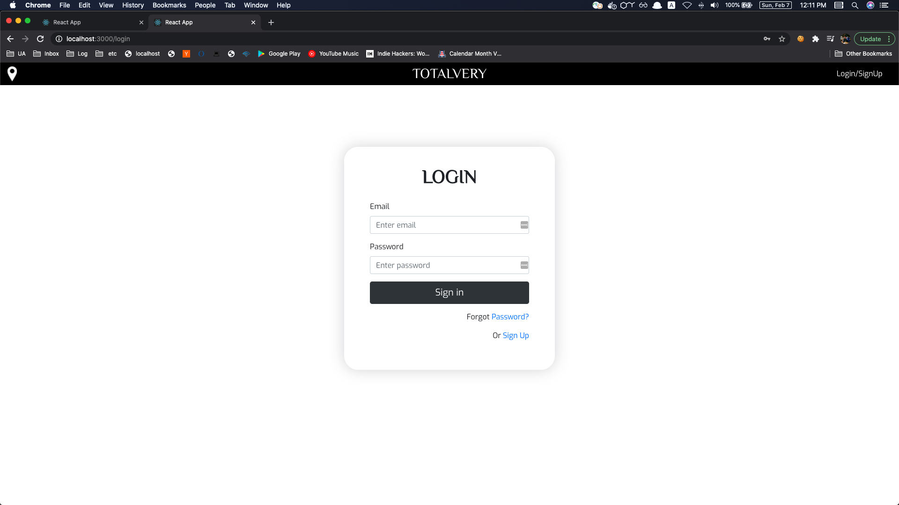
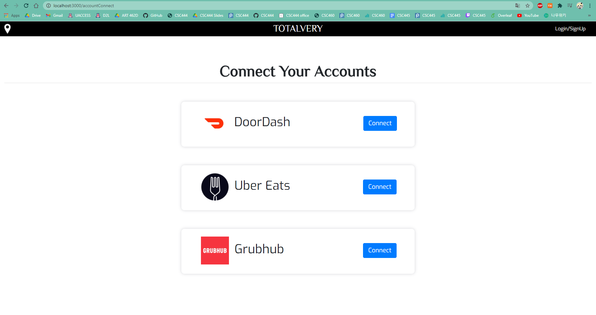

# Totalvery

  Totalvery helps you compare the price, the estimated time of arrival, and offers between the top food delivery services such as UberEats, DoorDash, and GrubHub.

## To-do

- [x] Create a Totalvery API that returns a restaurant list around the user and the information of a restaurnat by aggregating data from all the delivery apps
- [x] Connect a MongoDB
- [x] Implement functionality to filter restaurants based on the user preference
- [ ] Implement functionality to enable users to link their account with UberEats, Doordash and GrubHub, which helps Totalvery provide more reliable information about estimated fees

## Instruction

_First of all, you need a __US IP__ because some apps where Totalvery crawls data in real-time may not be available in your country other than the US. You can set a US IP with VPN. Then, you have to install __Docker__ in order to build the environment._

To run this app:

   ```
   $ git clone https://github.com/Totalvery/totalvery.git
   $ cd totalvery
   $ docker-compose down -v
   $ docker-compose up --build
   ```

Then you can see the demo web page with your local computer:

    $ http://localhost:3000/

## Usage of Google Cloud

- Google Places API
  - Used for address autocomplete at search bar
- Google Maps Javascript API
  - Used to show map for the searched location

## Uniqueness Compared to Other Similar Apps

- Includes promotion deals
- Offers user to filter restaurants based on their preference 
- Also, we plan to show membership-applied fees and offers by connecting accounts

## Result










# Learning Outcomes

- Coding with team
- Using Docker to code in equal environments
- Using React to build frontend
- Using Bootstrap for frontend design and development
- Learning how to use Javascript, HTML and CSS
- Learning how to use the Python Requests libary to get information 
- Using Django REST Framework to build API 
- Connecting MongoDB with Django for better performance 

## Author

Hyoseo Kwag / [@REJIHA](https://github.com/REJIHA/)

Hyunju Song / [@Sarahssong98](https://github.com/Sarahssong98/)

Sooyoung Moon / [@symoon94](https://symoon94.github.io/)


<!-- Docker 위에서 makemigrations 또는 migrate 하는 법

1. 터미널에서 docker ps 커맨드를 입력합니다.

```

docker ps

```

2. 위에서 얻은 결과로부터 CONTAINER ID 값을 알아낸 후 다음과 같이 실행시켜 줍니다.

```

docker exec -it [CONTAINER ID] python manage.py makemigrations

```

```

docker exec -it [CONTAINER ID] python manage.py migrate

```

``` -->
